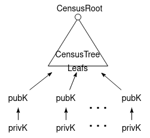
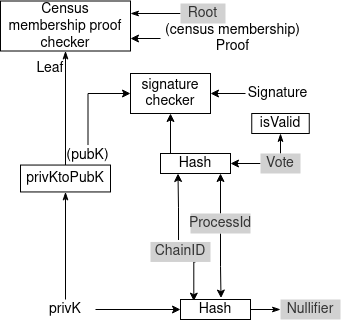
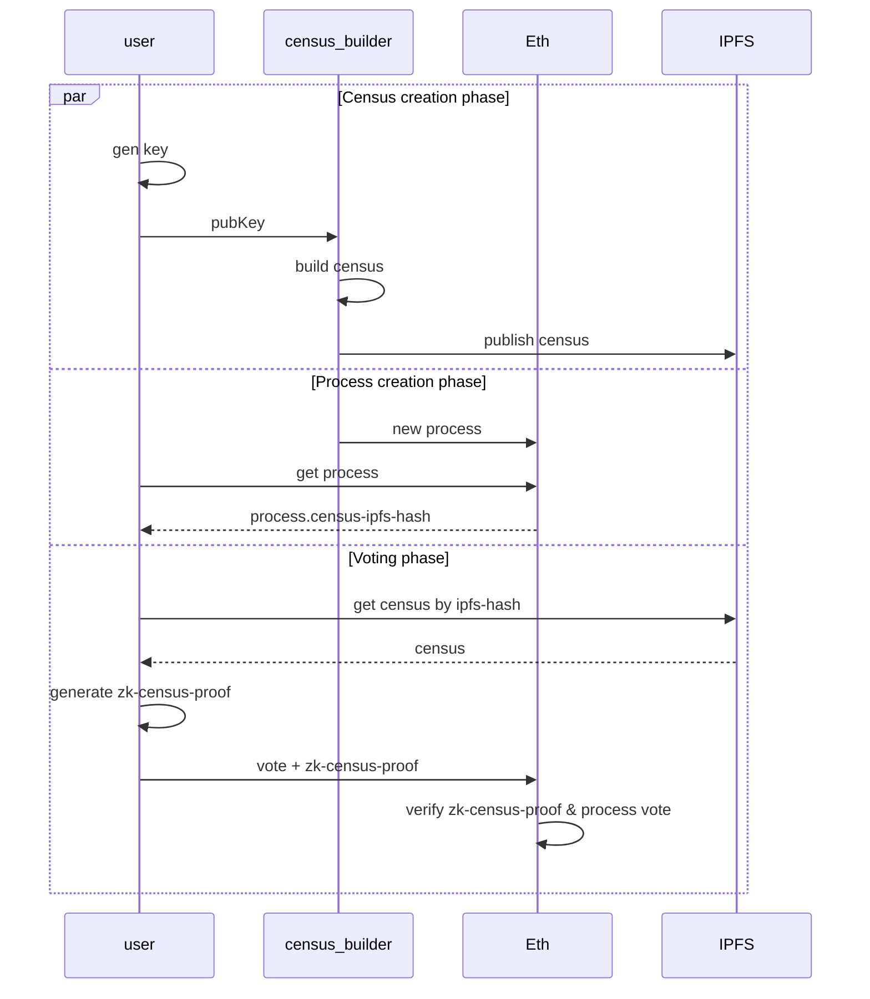

# anon-voting-demo

Onchain Anonymous Voting demo.

**TL;DR**: users vote onchain by sending a zk-proof where they prove that they belong to the census without revealing who they are in it.

This project builds on top of [OAV](https://github.com/aragonzkresearch/ovote#oav-onchain-anonymous-voting) circuits, which follows a similar design done in [vocdoni/zk-franchise-proof](https://github.com/vocdoni/zk-franchise-proof-circuit) and [Semaphore](https://semaphore.appliedzkp.org/).
The census in this project is compatible with [OVOTE](https://github.com/aragonzkresearch/research/blob/main/ovote/ovote.pdf) census, and a similar circuit design but implemented in arkworks can be found at [ark-anon-vote](https://github.com/aragonzkresearch/ark-anon-vote).

Target:
- DAOs that are non-token-based
- That want to have anonymous on-chain voting
- Which members are willing to pay gas costs (or DAO refunds it)

## Packages
- [smartcontracts](https://github.com/aragonzkresearch/anon-voting-demo/tree/main/smartcontracts)
- [clientlib](https://github.com/aragonzkresearch/anon-voting-demo/tree/main/clientlib)
- [react-ui](https://github.com/aragonzkresearch/anon-voting-demo/tree/main/react-ui)

## Overview

Users send their vote + zk-proof to the smart contract, proving that they belong to the census (without revealing who they are) and that their vote has not been already casted.

The census is build from the public keys of the DAO members.

Each user computes a zk-proof which will be verified onchain. Proof proves:
- They know a *privK* corresponding to a *pubK* (without revealing any of both)
- *pubK* is placed in some CensusTree leaf (without revealing which one) under the CensusRoot (which is set in the contract on process creation)
- *privK* has signed a hash of the *vote+chainID+processID*
- *signature* hashed together with the *ProcessId* and *ChainID* leads to the given *Nullifier*, which the contract ensures that has not already been used, in order to prevent double voting
- *vote* contains a valid value (either 0 or 1, yes/no)

Circuit (grey background indicates public inputs):

### User flow
- User connects wallet and generates their voting key
- User sends their voting key to CensusBuilder
- CensusBuilder builds the census and publishes it to IPFS
- Voting phase
    - User selects the voting process (in which the user is a member of the census)
    - User generates a zk-proof
        - proves that the user belongs in census, without revealing their pubK
    - User sends vote + zkproof to the contract
    - Contract verifies zkproof and counts the vote
- Voting process ends, if enough support tx gets executted

